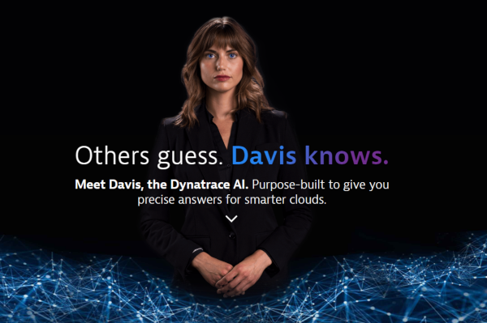

# The 💸 Bankservice

With this small tutorial we will get a better understanding on how Davis baselines all transactions in your environment. This is **key** for **automatic Root Cause analysis**. 

Davis does a tremendous job doing this with zero configuration. Nevertheless here is a specific small application that deviates from standards and executes small Jobs from multiple threads running in the background. With a little bit of configuration and human intuition we'll be able to **help Davis help us!**

## About the Bankservice application

This is a simple java application that can run as a standalone JVM or inside a docker container. This application executes small task in the background from different threads placed in different thread groups. The idea of this application is for educational purposes only. With Dynatrace you'll create a custom service to expose all transactions and then rename the transactions so Davis can calculate automatically the hotspots and will baseline every single Job-type. With this small configuration, Dynatrace will automatically keep track of all different types of jobs (even when executed in the background) and you can then go to sleep peacefully without having to configure any thresholds nor alerts and if something fails, Davis will let you know, automatically 🤩. **So, let's help Davis helps us**

## Prerequisites

- [Docker](https://www.docker.com/)
- [A Dynatrace Tenant](https://www.dynatrace.com/trial/?gclid=Cj0KCQiAqNPyBRCjARIsAKA-WFzFj8-YaXYjzaY7uVGj0klG2KnGTs2WaQ8Wg3AI_Z8dX2Fzy9-fOy4aAu5IEALw_wcB)

## ✍ Doing the tutorial

The version shinojosa/bankjob:perform2020 was presented in the Session Advanced Diagnostics with Dynatrace during the event [Perform 2020 in las Vegas](https://www.dynatrace.com/perform-vegas/).  The Slides for doing this exercise are in the [Dynatrace University 👨‍🎓](https://university.dynatrace.com/)  under the Advanced Diagnostics with Dynatrace Session under Perform 2020. 

In the *Perform2020* version of the Bankservice, the checkURL job calls a REST endpoint of the EasyTravel application through the docker network of the host which is hosting also EasyTravel. A problem was triggered for the Students environment via REST and the performance degradation was analyzed on real time and on demand starting from the Bankservice. For setting up such an environment take a loot at the [Dynatrace REST Tenant Automation](https://github.com/sergiohinojosa/Dynatrace-REST-Tenant-Automation)

- ### [🛠 Running , configuring and developing the Bankservice App](bankservice-explained.md)

- ### [📗 Excurs - Enhancing and customizing the Service Detection via API](excurs-service-detection-api.md)

#### Author sergio.hinojosa@dynatrace.com